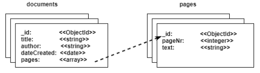

# Elevait Practical Task - API application

<!-- TABLE OF CONTENTS -->
<details open="open">
  <summary>Table of Contents</summary>
  <ol>
    <li>
      <a href="#about-the-project">About The Project</a>
    </li>
    <li>
      <a href="#technical-stack">Technical Stack</a>
    </li>
    <li>
      <a href="#getting-started">Getting Started</a>
      <ul>
        <li><a href="#prerequisites">Prerequisites</a></li>
        <li><a href="#project-installation">Project Installation</a></li>
      </ul>
    </li>
    <li><a href="#tests">Tests</a></li>
  </ol>
</details>

<!-- About The Project -->
# About The Project
This is an application in response to the **Elevait Practical Task**

<!-- Technical Stack -->
# Technical Stack
This Ruby on Rails API serves as a Back-End for the ReactJS [Elevait Practical Task](https://github.com/Martinfzz/elevait_practical_task_front) application.


### Languages and frameworks
* [Ruby - ver. 2.7.1](https://ruby-doc.org/core-2.7.1/)
* [Ruby on Rails - ver. 6.1.3](https://rubyonrails.org/)

### PostGreSQL database
The detailed database schema can be previewed below.



### Ruby Gems
* [Gem Rack-Cors](https://github.com/cyu/rack-cors)
* [Gem Faker](https://github.com/faker-ruby/faker)
* [Gem rspec-rails](https://github.com/rspec/rspec-rails)

<!-- GETTING STARTED -->
# Getting Started
To get a local copy and run this project locally, please follow these steps.

## Prerequisites

Be sure to have the proper version of Ruby on Rails and Ruby installed on your machine.
1. Check your Ruby on Rails & Ruby version
```sh
rails -v
ruby -v
```
2. In case of older version, please run the following command line to install Ruby on Rails 
```sh
gem install rails -v 6.1.3
```
See Rails Guides for more information on how to install Ruby on Rails & Ruby : [Getting Started with Rails](https://guides.rubyonrails.org/getting_started.html#creating-a-new-rails-project-installing-rails)

## Project Installation

1. Clone the repo
```sh
  git clone https://github.com/Martinfzz/elevait_practical_task_back
```
2. Install Gemfile bundle
```sh
  bundle install
```
3. Create a local PostgreSQL database  
```sh
  rails db:create
```
4. Run the database migration and generate the seed  
```sh
  rails db:migrate
  rails db:seed
```
5. Start the server
```sh
  rails server
```

# Tests

If you want to run the severals tests, run the following command:

```sh
  rspec
```

For more specific actions, please contact [Martinfzz](https://github.com/Martinfzz)